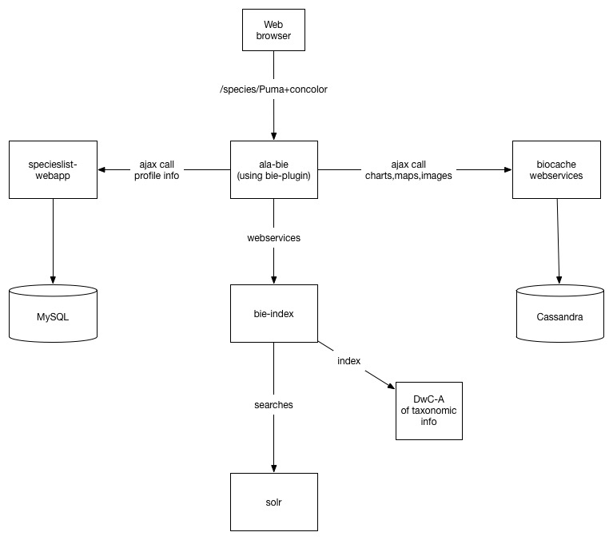

# bie-index [](https://app.travis-ci.com/github/AtlasOfLivingAustralia/bie-index)

bie-index is a grails web application that indexes taxonomic content in DwC-A and provides search web services for this content.
This includes:

- faceted taxonomic search with synonymy support
- search across other entities including:
    - regions
    - spatial layers
    - data resources
    - institutions
    - collections
- autocomplete services
- CSV download services
- bulk taxonomic lookup services by name or GUID
- retrieval of full classification (major and non-major taxonomic ranks e.g. sub-order, sub-family)
 
This project provides JSON webservices and an interface for admin users. It does not include a HTML interface for end users. 
There is a set of front end components available providing the species pages listed here:

- [bie-plugin](http://github.com/AtlasOfLivingAustralia/bie-plugin) - a grails plugin providing species pages & search interfaces
- [ala-bie](http://github.com/AtlasOfLivingAustralia/ala-bie) - the ALA version of this front end
- [generic-bie](http://github.com/AtlasOfLivingAustralia/generic-bie) - a generic version of this front end for use as a starting point for other countries reusing ALA components.

For an introduction to the approach to names within the ALA, [nameology](https://github.com/AtlasOfLivingAustralia/bie-index/blob/master/doc/nameology/index.md) is a good place to start.

## Darwin Core archive format of taxonomic information

This application currently supports the ingestion of Darwin Core archive (DwC-A) with the following mandatory darwin core fields in the core file:

- [taxonID](http://rs.tdwg.org/dwc/terms/#taxonID)
- [parentNameUsageID](http://rs.tdwg.org/dwc/terms/#parentNameUsageID)
- [acceptedNameUsageID](http://rs.tdwg.org/dwc/terms/#acceptedNameUsageID)
- [scientificName](http://rs.tdwg.org/dwc/terms/#scientificName)
- [scientificNameAuthorship](http://rs.tdwg.org/dwc/terms/#scientificNameAuthorship)
- [taxonRank](http://rs.tdwg.org/dwc/terms/#taxonRank)

Additional fields can be added which will allow more sophisticated handling of names

- [nameComplete](http://ala.org.au/terms/1.0/nameComplete) An explicit complete name. If not specified, the scientificNameAuthorship (if present) is appended to the scientificName to make the canonical name.
- [nameFormatted](http://ala.org.au/terms/1.0/nameFormatted) An explicitly formatted name, with name, author and structural parts marked by `<span class="...">` elements. If not explicitly present, it is constructed from the information available. See [Name Formatting](doc/nameology/name-formatting.md) for details.
- [source](http://purl.org/dc/terms/source) A URL for a source of the name. This can be used to link to a page containing the original data.
- [datasetID](http://rs.tdwg.org/dwc/terms/#datasetID) The uid of the collectory dataset ID. If provided, then a link to the dataset description will be provided

Additional fields added to the core file e.g. establishmentMeans or any other field will also be indexed and available for facetted searching.

An extension file of vernacular names is also supported.
The format support here aligns with the same format supported by the [ala-names-matching API](https://travis-ci.org/AtlasOfLivingAustralia/ala-name-matching).

Additional fields , which will allow more sophisticated handling of vernacular names are:

- [status](http://ala.org.au/terms/1.0/status) An indicator of the relative importance of the vernacular name. The controlled vocabulary is read from [vernacularNameStatus.json](grails-app/config/vernacularNameStatus.json)
- [source](http://purl.org/dc/terms/source) A URL for a source of the vernacular name. This can be used to link to a page containing the original data.
- [datasetID](http://rs.tdwg.org/dwc/terms/#datasetID) The uid of the collectory dataset ID. If provided, then a link to the dataset description will be provided

An extension file of additional identifiers is also supported.
The format aligns with the [GBIF identfier](http://rs.gbif.org/terms/1.0/Identifier) format.

Additional fields, which will allow more sophisticated handling of identifiers are:

- [status](http://ala.org.au/terms/1.0/status) An indicator of the relative importance of the identifier. The controlled vocabulary is read from [identifierStatus.json](grails-app/config/identifierStatus.json)
- [source](http://purl.org/dc/terms/source) A URL for a source of the identifier. This can be used to link to a page containing the original data.
- [datasetID](http://rs.tdwg.org/dwc/terms/#datasetID) The uid of the collectory dataset ID. If provided, then a link to the dataset description will be provided

### eml.xml

A Darwin Core Archive may contain an `eml.xml` metadata file, in the [Ecological Metadata Language](https://knb.ecoinformatics.org/#tools/eml) format.
If available, default information is gathered from the metadata file:

- **datasetName** Derived from `eml/dataset/title`

### Basic example meta.xml

Below is an example meta.xml that would be provided in a darwin core archive.

```xml
<archive xmlns="http://rs.tdwg.org/dwc/text/" metadata="eml.xml">
  <core encoding="UTF-8" fieldsTerminatedBy="," linesTerminatedBy="\n" fieldsEnclosedBy="&quot;" ignoreHeaderLines="1" rowType="http://rs.tdwg.org/dwc/terms/Taxon">
    <files>
      <location>taxon.csv</location>
    </files>
    <id index="0" />
    <field term="http://rs.tdwg.org/dwc/terms/taxonID"/>
    <field index="1" term="http://rs.tdwg.org/dwc/terms/parentNameUsageID"/>
    <field index="2" term="http://rs.tdwg.org/dwc/terms/acceptedNameUsageID"/>
    <field index="3" term="http://rs.tdwg.org/dwc/terms/scientificName"/>
    <field index="4" term="http://rs.tdwg.org/dwc/terms/scientificNameAuthorship"/>
    <field index="5" term="http://rs.tdwg.org/dwc/terms/taxonRank"/>
  </core>
  <extension encoding="UTF-8" fieldsTerminatedBy="," linesTerminatedBy="\n" fieldsEnclosedBy="&quot;" ignoreHeaderLines="1" rowType="http://rs.gbif.org/terms/1.0/VernacularName">
    <files>
      <location>vernacular.csv</location>
    </files>
    <coreid index="0" />
    <field term="http://rs.tdwg.org/dwc/terms/taxonID"/>
    <field index="1" term="http://rs.tdwg.org/dwc/terms/vernacularName"/>    
  </extension>
</archive>
```

## Example archives

- UK Species inventory


## Integration points

In addition to indexing the content of the darwin core archive, the ingestion & index creation (optionally) indexes data from the following ALA components. It does this by harvesting JSON feeds from the listed components.

- Layers & regions - http://spatial.ala.org.au/layers - spatial layers available in the system and regions (e.g. states, countries)
- Collectory - http://collections.ala.org.au - data resource, collections, institutions
- Lists and traits - http://lists.ala.org.au - conservation lists, sensitive species lists, traits
- Biocache services - http://biocache.ala.org.au/ws - images, occurrence record counts

## Architecture

This application makes use of the following technologies

- Apache SOLR 6.6.x
- Grails 3.2.x
- Tomcat 7 or higher
- Java 8 or higher



## Handling URLs as taxon IDs

Some taxonIDs are now URLs, rather than LSIDs.
When provided to the server un-encoded, everything is fine.
However, if encoded with slashes being replaced by `%2F` then tomcat treats this as a security error and
returns a 400 error.
To allow encoded slashes in tomcat, start the server with `-Dorg.apache.tomcat.util.buf.UDecoder.ALLOW_ENCODED_SLASH=true`

## Image scans

An image scan will search the biocache for suitable images to act as an example image for the taxon.
The image scan configuration can be located in `/data/bie-index/config/image-lists.json` and
references by `imageListsUrl` in the configuration properties.
An example image list configuration is 

```
{
  "boosts": [
    "record_type:Image^10",
    "record_type:HumanObservaton^20",
    "record_type:Observation^20",
    "-record_type:PreservedSpecimen^20"
  ],
  "ranks": [
    {
      "rank": "family",
      "idField": null,
      "nameField": "family"
    },
    {
      "rank": "genus",
      "idField": "genus_guid",
      "nameField": "genus"
    },
    {
      "rank": "species",
      "idField": "species_guid",
      "nameField": "taxon_name"
    }
  ],
  "lists": [
    {
      "uid": "dr4778",
      "imageId": "imageId"
    }
  ]
}
```

For each candidate taxon, a query is constructed that boosts certain characteristics of the occurrence in the
hopes of finding something that doesn't look terribly dead. The `boosts` element contains the list of boosts to apply
(in the example, observations and images get a boost, preserved specimens are downgraded and images from dr130 are 
preferred.

The `required` and `preferred` elements contain lists of filter queries that are applied to the search.
For example,`geospatial_kosher:true` restricts searches to occurrences that
appear to be geospatially usable.

Only certain ranks get images attached to them.
The `ranks` element contains taxon ranks that should have images associated with them,
along with the fields in the occurrence records that allow an occurrence to be found.
The `idField` provides a specific biocache field that will be searched for the taxon identifier.
It can be left null for ranks that have no biocache index fields.
The `nameField` provides a specific biocache field that will be searched for the taxon name.
Again, it can be left null for ranks with no name.
The `lsid` field is always searched, to see if there is an ocurrence record that is specifically
named as the taxon.

The `lists` elment contains species lists that manually specify preferred heroic images for species.
The species lists should have a column that supplies the image imageId, so that the image
can be found on the image server. Multiple lists can be used, with highest priority going to the first entry.
The `uid` holds the list identifier to load.

## Vernacular Name Lists

Vernacular names can be drawn from species lists on the list server.
The vernacular name configuration can be located in `/data/bie-index/config/vernacular-lists.json` and
referenced by `vernacularListsUrl` in the configuration properties.

An example vernacular name list configuration is

```
{
  "defaultVernacularNameField": "name",
  "defaultNameIdField": "nameID",
  "defaultKingdomField": "kingdom",
  "defaultStatusField": "status",
  "defaultLanguageField": "language",
  "defaultsourceField": "source",
  "defaultTemporalField": "temporal",
  "defaultLocationIdField": "locationID",
  "defaultLocalityField": "locality",
  "defaultCountryCodeField": "countryCode",
  "defaultSexField": "sex",
  "defaultLifeStageField": "lifeStage",
  "defaultIsPluralField": "isPlural",
  "defaultIsPreferredField": "isPreferred",
  "defaultOrganismPartField": "organismPart",
  "defaultLabelsField": "labels",
  "defaultTaxonRemarksField": "taxonRemarks",
  "defaultProvenanceField": "provenance",
  "defaultStatus": "common",
  "defaultLanguage": "en",  
  "lists": [
    {
      "uid": "drt1464664375273",
      "taxonRemarksField": "Notes",
      "defaultLanguage": "xul"
      "defaultStatus": "traditionalKnowledge"
      
    },
    {
      "uid": "drt1464664375274",
      "defaultLanguage": "fr",
      "statusField": "priority"
    }
  ]
}
```

The default entries provide useful defaults for things like the list fields that hold various pieces of information.
These can be overridden at the list level.
The various fields refer to the fields that can be part of the GBIF vernacular names extension.
The `defaultLanguage` and `defaultStatus` entries provide per-list defaults for language and status entries.
Languages should be ISO-639 two- or three-letter codes or AIATSIS codes; the bie-plugin can expand these out.
The `uid` holds the list identifier to load.

**Avoid using vernacularName or commonName as the vernacular name field** 
The list server treats these in a special way, causing problems when attempting to retrieve the names.

## Conservation Status Lists

Conservation status information can also be drawn from species lists.
The conservation configuration can be located in `/data/bie-index/config/conservation-lists.json` and
referenced by `conservationListsUrl` in the configuration properties.

An example conservation status list configuration is

```
{
  "defaultSourceField": "status",
  "defaultKingdomField": "kingdom",
  "lists": [
    {
      "uid": "dr656",
      "field": "conservationStatusAUS_s",
      "term": "conservationStatusAUS",
      "label": "AUS"
    },
    {
      "uid": "dr655",
      "field": "conservationStatusVIC_s",
      "term": "conservationStatusVIC",
      "label": "VIC",
      "sourceField": "statusName",
      "kingdomField": "kgm"
    }
  ]
}
```

The `uid` supplies the list identifier.
The `field` supplies the solr field which will be used to store the conservation status.
The `term` supplies the name of the status field.
`label` gives the label to apply to the conservation status.
`sourceField` gives the name of the field that contains the conservation status.
`kingdomField` gives the name of the field that contains the kingdom -- handy for name lookups, if available.

## Weighting Rules

Calculating weights for search and autosuggest operations gets rather complicated,
score-calculated weights for seach operations are built into each document
during the import process.

Anything with an idxtype field is annotated with weights.

The weighting rules come from a configuration file, which defaults to
[default-weights.json](grails-app/conf/default-weights.json) and which can be
set by `import.weightConfigUrl` in the configuration.
An example set of weighting rules is

```
{
  "script": "nashorn",
  "global": {
    "rules": [
      {
        "term": "taxonomicStatus",
        "exists": true,
        "rules": [
          {
            "value": "accepted",
            "weight": 2.0
          },
          {
            "value": "misapplied",
            "weight": 0.5
          }
        ]
      },
    ]
  },
  "weights": [
    {
      "field": "searchWeight",
      "rules": []
    },
    {
      "field": "suggestWeight",
      "rules": [
        {
          "term": "scientificName",
          "exists": true,
          "condition": "_value.length() > 4",
          "weightExpression": "_weight * 1.0 / (1.0 + Math.log(_value.length() * 0.01 + 1.0))",
          "comment": "The longer the name, the less it should be suggested. Mean name length is 16"
        }
      ]
    }
  ]
}
```

The top level contains the following fields:

* **script** The name of the script engine for evaluating *condition* and *weightExpression* rules.
  By default, this is the *nashorn* javascript engine.
* **global** Rules to apply to all weights.
* **weights** Specific weight fields. These have their own field names and rules
  that are applied after the global rules.

Rules consist of the following entries:

* **term** The term this rule applies to. The term may be absent, unless the *exists* field is set to true.
* **exists** Ensures that the term either exists or does not exist. 
  If absent, then the rule applies wether the term exists or not, although most rules will not trigger on an empty value.
* **value** The value required for the rule to trigger (case sensitive for string values).
  If the value is a list, then any matching term will trigger the rule.
* **match** A regular expression to match the term against.
    If the value is a list, then any matching term will trigger the rule.
* **condition** A script expression to test. The script is in whatever scripting language
  is used and must return a boolean value. Any term from the input document
  can be used in the expression (eg. `kinmgdom == 'Plantae'`).
  If there is a *term* supplied then the value is supplied to the script as `_value`.
  If the value is a list, then any matching term will trigger the rule.
* **weight** The weight to multiply the existing weight by.
* **weightExpression** A script expression to calculate the weight, in
  a similar manner to *condition* The returned value does not necessarily
  multiply the existing weight, it needs to be explicitly included, as `_weight`
  so that you can do clever things with the weight value.
* **rules** Sub-rules. These inherit things like *term* from their parent
  and only trigger if the parent conditions are true. The weight adjustments
  occur after the application of any parent adjustment.
  Note that sub-rules can refer to different terms, creating and and-condition.
* **comment** If you want to document something.

As an example, the above rules, applied to the input
`[idxtype:'TAXON', taxonomicStatus:'misapplied', scientificName:'Atrobucca brevis']` 
and with a start value of 1.0 would give.

* Global rules weight = 1.0 * 0.5 = 0.5 for a taxonomicStatus of misapplied.
* searchWeight = 0.5
* suggestWeight = 0.5 * (1 / (1 + ln(0.15 + 1))) = 0.4387, since the length of the scientificName is greater than 4.

## Favourites

The favourites function allows lists from the lists tool to be used to mark taxa or 
common names as having a "favourite" status.
The favourite status is a term, such as `preferred` or `iconic` that can be used to
mark entries for faceting and weight calculation.

The favourites configuation comes from a configuration file, which defaults to [default-favourites.json](grails-app/config/default-favourites.json) and which
can be set by `import.favouritesConfigUrl` in the configuration.
An example favourites configuration is:

```
{
  "defaultTerm": "favourite",
  "lists": [
    {
      "uid": "dr4778",
      "termField": "favourite",
      "defaultTerm": "interest"
    },
    {
      "uid": "dr781",
      "defaultTerm": "iconic"
    }
  ]
}
```

The top level contains the following entries:

* **defaultTerm** The term to use by default for any list where the favourite term is not specified.
* **lists** The lists, in the lists tool, that contain favourite lists.

Each list can contain

* **uid** (required) The UID of the list
* **termField** If the list contains per-entry terms, the field which contains the term. Defaults to none.
* **defaultTerm** The term to use if one is not specified for the entry. Defaults to the global default term.

Favourites only mark selected taxa and their associated common names with favourite terms.
Once marked, it is up to the bie-plugin otr weighting rules to make use of these terms.